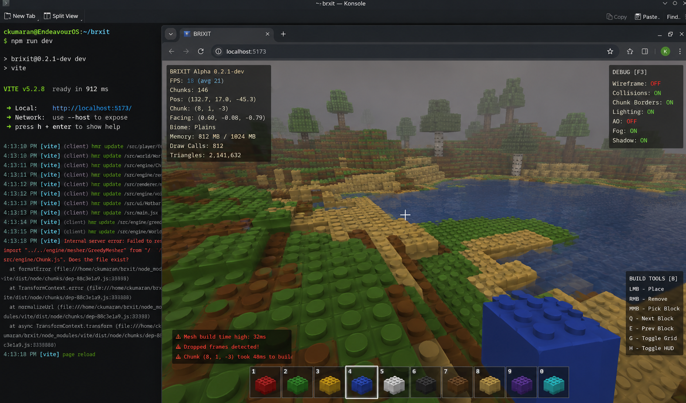

# 🧱 BRIXIT

> *A LEGO-inspired voxel sandbox engine built from scratch with React, Three.js, and React Three Fiber.*

```
██████╗ ██████╗ ██╗██╗  ██╗██╗████████╗
██╔══██╗██╔══██╗██║╚██╗██╔╝██║╚══██╔══╝
██████╔╝██████╔╝██║ ╚███╔╝ ██║   ██║   
██╔══██╗██╔══██╗██║ ██╔██╗ ██║   ██║   
██████╔╝██║  ██║██║██╔╝ ██╗██║   ██║   
╚═════╝ ╚═╝  ╚═╝╚═╝╚═╝  ╚═╝╚═╝   ╚═╝  
                                        
   Build. Explore. Create. No limits.
```

> **Tech Stack:** React · Three.js · React Three Fiber · JavaScript  
> **Type:** Custom Voxel Engine + Creative Sandbox Game  
> **Status:** 🧪 Alpha — Pre-optimization, actively in development  
> **Philosophy:** Build anything. Survive nothing.  
> **Built as:** A solo side project to learn voxel engine architecture from the ground up.

---

## 🎮 Working Demo



> *Yes, it actually runs. In a browser. Built by one person. Please clap.*

---

## Table of Contents

1. [What is BRIXIT?](#1-what-is-brixit)
2. [Inspiration](#2-inspiration)
3. [Features](#3-features)
4. [Screenshots](#4-screenshots)
5. [Core Engine Systems](#5-core-engine-systems)
6. [Full Repo Structure](#6-full-repo-structure)
7. [Deep Explanation of Every Folder](#7-deep-explanation-of-every-folder)
8. [Deep Explanation of Every Important File](#8-deep-explanation-of-every-important-file)
9. [Rendering Pipeline](#9-rendering-pipeline)
10. [Chunk System Explained](#10-chunk-system-explained)
11. [Greedy Meshing Explained](#11-greedy-meshing-explained)
12. [Terrain Generation Explained](#12-terrain-generation-explained)
13. [Physics + Collision Explained](#13-physics--collision-explained)
14. [LEGO Material System Explained](#14-lego-material-system-explained)
15. [Water + Lighting System Explained](#15-water--lighting-system-explained)
16. [Save System Explained](#16-save-system-explained)
17. [Build Tools / Master Builder Vision](#17-build-tools--master-builder-vision)
18. [Optimization Techniques](#18-optimization-techniques)
19. [Future Roadmap](#19-future-roadmap)
20. [Installation Guide](#20-installation-guide)
21. [Controls](#21-controls)
22. [How To Run](#22-how-to-run)
23. [Performance Notes](#23-performance-notes)
24. [Lessons Learned](#24-lessons-learned)
25. [Why This Project Matters](#25-why-this-project-matters)
26. [Credits](#26-credits)
27. [License](#27-license)

---

## 1. What is BRIXIT?

BRIXIT is a **voxel sandbox engine and game** built entirely in the browser using React, Three.js, and React Three Fiber. The world is made of colorful, LEGO-inspired blocks — plastic, shiny, chunky. You place them. You break them. You build things that are big and beautiful and completely yours.

There is no hunger bar. No health points. No monsters chasing you at night. BRIXIT doesn't ask you to survive — it asks you to *create*.

At its heart, BRIXIT is a custom voxel engine written from scratch. That means the code that decides which blocks exist, how they're grouped into chunks, how those chunks turn into triangles, how those triangles get sent to your GPU, how the terrain is procedurally generated, how collision is detected, how blocks are placed and removed — all of that is hand-built. Not imported from a game engine. Not abstracted away by Unity or Godot. Written. From. Scratch.

### What does "voxel" mean?

Think of the world as a 3D grid. Every cell in that grid is a **voxel** — a volumetric pixel. Each voxel either contains a block or is empty air. Zoom out and you get a Minecraft-like world. Zoom in and you get a LEGO set. BRIXIT sits exactly between the two: it renders blocks with the scale and scope of Minecraft, but gives them the colorful, tactile, plastic feel of LEGO bricks.

```
What a voxel world looks like in memory:

  Z axis →
Y ↑  [ ][ ][ ][ ][ ]
     [ ][X][ ][ ][ ]   ← X = block exists here
     [ ][ ][X][X][ ]
     [X][X][X][X][X]
     [X][X][X][X][X]
         X axis →

Each [X] is a filled voxel. Each [ ] is empty air.
Billions of these cells make up the world.
```

### What does "custom engine" mean?

Most games are built on top of an existing engine like Unity, Unreal, or Godot. The engine handles all the hard stuff — rendering, physics, input, audio, memory. You write the game logic on top.

BRIXIT skips the engine. The rendering logic is written using Three.js directly. The physics are hand-rolled using AABB (axis-aligned bounding box) collision detection. The chunk system, the mesher, the terrain generator, the material cache — all custom.

This is not the easiest way to make a game. But it's the best way to understand *how* games work at a fundamental level. And it produces a result that's uniquely yours.

> **⚠️ Current state:** BRIXIT is in active alpha. Core systems are written and working — terrain generation, chunk loading, LEGO stud geometry, lighting, shadows, water, and block interaction are all functional. The greedy meshing optimisation is implemented but not yet integrated, which means current triangle counts and frame rates are unoptimised. Performance figures in this README reflect post-optimisation targets, not current numbers. The screenshot above was taken at ~18–21 fps with greedy meshing disconnected. Once wired up, that changes significantly.

---

## 2. Inspiration

BRIXIT exists because three things collided in my head at the same time:

### LEGO

I grew up building with LEGO. Not following instructions — just making things. The satisfaction of snapping a block into place, the visual language of colorful interlocking bricks, the feeling that you could build *anything* if you just had enough pieces. LEGO taught me that constraints (uniform brick size, limited colors, no diagonal connections) are actually the source of creativity, not a limiter of it. BRIXIT inherits this philosophy directly.

### Minecraft

Minecraft proved that a world made of cubes could be beautiful, deep, and endlessly interesting. But Minecraft is a survival game at its core. Hunger, health, combat, crafting — these systems are brilliant for what Minecraft is trying to be. But they're not what I wanted. I wanted a pure creative sandbox. Minecraft's Creative Mode came close, but the blocks didn't feel like toys. They felt like pixels. BRIXIT tries to bring the toy-like quality back.

### The question "how does this actually work?"

I'd played Minecraft for years before I started wondering: *how does it render that world without melting your GPU?* How does it decide which faces to draw and which to skip? How does it store a world that's theoretically infinite? How does it generate terrain that looks natural but is fully procedural?

BRIXIT is my attempt to answer every one of those questions by writing the code myself.

### Why a browser game?

Because the web is the most accessible platform on earth. No install. No launcher. No "your GPU doesn't support DirectX 12." Open a link, press a button, and you're building. Three.js and WebGL make real-time 3D rendering possible in a browser tab, and React Three Fiber makes that rendering feel like writing a React app. The stack choice wasn't arbitrary — it was the fastest path to a creative tool that anyone could open.

### Why NOT a survival game?

Survival mechanics exist to create **pressure**. They make the world feel dangerous and meaningful. But pressure is the enemy of pure creativity. When you're hungry, you're not thinking about architecture — you're thinking about food. When monsters are coming, you're not thinking about your build — you're thinking about defense.

BRIXIT is explicitly a **no-pressure zone**. The design decision to remove survival is intentional and permanent. The game's only goal is what you decide it is. Build a city. Build a mountain. Build nothing. The world doesn't care. It just waits.

---

## 3. Features

### 🎮 Core Gameplay
- **Infinite voxel world** — Procedurally generated terrain in all directions
- **Place and break blocks** — Left click to break, right click to place
- **Free-form building** — No resources, no crafting, no inventory limits
- **Block color picker** — Choose any color for your LEGO bricks
- **Multiple block types** — Standard, glass, terrain variants (dirt, stone, sand, wood, etc.)

### 🧱 LEGO-Inspired Rendering
- **Plastic material shaders** — Blocks have specular highlights, slight gloss, and a solid-color finish that feels like injection-molded plastic
- **Stud geometry** — Top-face studs on every block, just like real LEGO bricks. Visible in-engine now.
- **Vivid color palette** — Inspired by the classic LEGO color library: brick red, forest green, sky blue, royal yellow
- **Subsurface hint** — Colored blocks cast slight color influence on surrounding fog, giving the world a warm toy-box feel

### ⚙️ Engine Features
- **Custom chunk system** — World divided into 16×16×16 chunks, loaded and unloaded based on player position
- **Greedy meshing** *(implemented, integration in progress)* — Adjacent same-type block faces merged into single quads for maximum render efficiency. Written and tested; import path currently broken, wiring it up is the immediate next task
- **Face culling** — Hidden faces between solid blocks never generated or sent to GPU
- **Frustum culling** — Chunks outside the camera's view frustum skipped entirely
- **Procedural terrain** — Multi-octave Perlin noise for height maps and biome-like variation
- **LOD system** (in progress) — Distant chunks rendered at lower geometric detail
- **Delta-time physics** — Frame-rate independent movement and collision
- **AABB collision** — Accurate axis-aligned bounding box collision with the block world

### 💾 Save System
- **LocalStorage persistence** — World saves to the browser automatically
- **Chunk-level diffs** — Only modified chunks are stored, not the entire world
- **Export/import** (planned) — Download your world as a JSON file, share with others

### 🌊 World Systems
- **Atmospheric fog** — Distance-based fog that gives worlds a sense of scale
- **Ambient + directional lighting** — Three.js lights that give blocks depth and dimension
- **Water rendering** (in progress) — Translucent animated water blocks with refraction
- **Sky system** — Gradient sky with configurable time-of-day

---

## 4. Screenshots


> Alpha 0.2.1-dev — Plains biome, 146 chunks loaded, shadows and lighting on. Debug overlay visible top-left. Pre-greedy-mesh integration, so triangle count (2,141,632) and draw calls (812) are currently unoptimised. The game still looks like this at 18fps. Post-optimisation target is 60fps+ on the same hardware.

> The block toolbar, build tools panel, and F3 debug overlay are all functional and visible here.

---

## 5. Core Engine Systems

Before diving into the details, here's a map of every major system in BRIXIT and how they connect:

```
╔══════════════════════════════════════════════════════════════════╗
║                     BRIXIT ENGINE OVERVIEW                       ║
╠══════════════════════════════════════════════════════════════════╣
║                                                                  ║
║  INPUT LAYER                                                     ║
║  ┌─────────────────────────────────────┐                         ║
║  │  Keyboard + Mouse → useInput hook   │                         ║
║  └──────────────┬──────────────────────┘                         ║
║                 │                                                ║
║  PLAYER LAYER   ↓                                                ║
║  ┌─────────────────────────────────────┐                         ║
║  │  usePlayer → movement + collision   │                         ║
║  │  Camera follows player position     │                         ║
║  └──────────────┬──────────────────────┘                         ║
║                 │                                                ║
║  WORLD LAYER    ↓                                                ║
║  ┌─────────────────────────────────────────────────────────┐     ║
║  │                   WorldManager                          │     ║
║  │  ┌────────────────┐   ┌──────────────────────────────┐  │     ║
║  │  │ TerrainGen     │   │ ChunkManager                 │  │     ║
║  │  │ (Perlin Noise) │──▶│ load / unload / dirty queue  │  │     ║
║  │  └────────────────┘   └───────────────┬──────────────┘  │     ║
║  └──────────────────────────────────────-┼─────────────────┘     ║
║                                          │                       ║
║  MESH LAYER     ↓                        ↓                       ║
║  ┌─────────────────────────────────────────────────────────┐     ║
║  │                   Mesher                                │     ║
║  │  face culling → greedy meshing → BufferGeometry         │     ║
║  └──────────────────────────┬────────────────────────────--┘     ║
║                             │                                    ║
║  RENDER LAYER   ↓           ↓                                    ║
║  ┌─────────────────────────────────────────────────────────┐     ║
║  │               React Three Fiber Scene                   │     ║
║  │  frustum culling → material cache → GPU draw calls      │     ║
║  └─────────────────────────────────────────────────────────┘     ║
║                                                                  ║
║  PERSISTENCE LAYER                                               ║
║  ┌─────────────────────────────────────────────────────────┐     ║
║  │  SaveManager → LocalStorage → world diff storage        │     ║
║  └─────────────────────────────────────────────────────────┘     ║
╚══════════════════════════════════════════════════════════════════╝
```

Each of these layers is explained in exhaustive detail in the sections below.

---

## 6. Full Repo Structure

```
brixit/
│
├── public/
│   ├── index.html
│   ├── favicon.ico
│   └── screenshots/
│
├── src/
│   ├── main.jsx                    ← App entry point
│   ├── App.jsx                     ← Root component, canvas setup
│   │
│   ├── engine/                     ← All custom voxel engine code
│   │   ├── world/
│   │   │   ├── WorldManager.js     ← Orchestrates world state
│   │   │   ├── ChunkManager.js     ← Loads/unloads chunks
│   │   │   ├── Chunk.js            ← Single chunk data structure
│   │   │   └── BlockRegistry.js    ← Block type definitions
│   │   │
│   │   ├── terrain/
│   │   │   ├── TerrainGenerator.js ← Perlin noise terrain
│   │   │   ├── noise.js            ← Simplex/Perlin noise utils
│   │   │   └── biomes.js           ← Biome definitions
│   │   │
│   │   ├── meshing/
│   │   │   ├── Mesher.js           ← Main meshing pipeline
│   │   │   ├── GreedyMesher.js     ← Greedy meshing algorithm
│   │   │   └── FaceCuller.js       ← Face visibility logic
│   │   │
│   │   ├── physics/
│   │   │   ├── PhysicsEngine.js    ← AABB collision detection
│   │   │   ├── AABB.js             ← Bounding box math
│   │   │   └── collisionUtils.js   ← Helper functions
│   │   │
│   │   ├── rendering/
│   │   │   ├── MaterialCache.js    ← Cached Three.js materials
│   │   │   ├── ChunkMesh.jsx       ← R3F component for a chunk
│   │   │   └── FrustumCuller.js    ← Camera frustum culling
│   │   │
│   │   ├── lighting/
│   │   │   ├── LightingManager.js  ← Ambient + directional light
│   │   │   └── FogSystem.js        ← Distance fog parameters
│   │   │
│   │   └── save/
│   │       ├── SaveManager.js      ← Save/load world state
│   │       └── serializer.js       ← Chunk serialization
│   │
│   ├── player/
│   │   ├── usePlayer.js            ← Player state + movement hook
│   │   ├── useInput.js             ← Keyboard/mouse input hook
│   │   ├── Camera.jsx              ← First-person camera R3F
│   │   └── Raycaster.js            ← Block targeting raycaster
│   │
│   ├── ui/
│   │   ├── HUD.jsx                 ← In-game heads-up display
│   │   ├── BlockPicker.jsx         ← Color/block type selector
│   │   ├── Crosshair.jsx           ← Center crosshair overlay
│   │   └── DebugOverlay.jsx        ← FPS, chunk count, position
│   │
│   ├── water/
│   │   ├── WaterMesh.jsx           ← Animated water R3F mesh
│   │   └── waterShader.js          ← Custom GLSL water shader
│   │
│   ├── shaders/
│   │   ├── legoMaterial.js         ← LEGO plastic shader
│   │   ├── legoVertex.glsl         ← Vertex shader source
│   │   └── legoFragment.glsl       ← Fragment shader source
│   │
│   ├── hooks/
│   │   ├── useWorldState.js        ← Global world state hook
│   │   ├── useChunkLoader.js       ← Chunk streaming hook
│   │   └── useBlockInteraction.js  ← Place/break block hook
│   │
│   ├── constants/
│   │   ├── blocks.js               ← Block type IDs and properties
│   │   ├── world.js                ← Chunk size, render distance
│   │   └── colors.js               ← LEGO color palette
│   │
│   └── utils/
│       ├── math.js                 ← Vec3, coordinate helpers
│       ├── profiler.js             ← Performance measurement
│       └── debugTools.js           ← Dev-mode helpers
│
├── package.json
├── vite.config.js
├── .eslintrc.js
└── README.md
```

---

## 7. Deep Explanation of Every Folder

### `/src/engine/`

This is the heart of BRIXIT. Everything in here is pure engine code — no React, no UI, just the raw math and data structures that make the voxel world work. If you wanted to rip the engine out and use it in a different project, this folder is what you'd take.

The engine is organized into subsystems, each responsible for a clearly defined part of the world:

- **`world/`** — The authoritative data store. Knows what blocks exist where.
- **`terrain/`** — Generates the initial block data using noise functions.
- **`meshing/`** — Converts block data into 3D geometry (triangles).
- **`physics/`** — Handles movement and collision for the player.
- **`rendering/`** — Manages how geometry gets drawn on screen.
- **`lighting/`** — Controls the scene's lights and fog.
- **`save/`** — Persists the world state between sessions.

### `/src/engine/world/`

The world subsystem is the single source of truth for block data. Every other system either reads from it or writes to it. It doesn't know anything about rendering or physics — it just knows which blocks are where.

`WorldManager.js` is the top-level orchestrator. It tracks which chunks are "alive" (loaded), which are dirty (need remeshing), and mediates all block read/write operations.

`ChunkManager.js` handles the lifecycle of chunks: creating new ones when the player walks toward them, recycling old ones when they move out of range, and maintaining the pool of active chunks in memory.

`Chunk.js` is the data structure for a single chunk. A chunk is a 16×16×16 array of block IDs. That's 4,096 voxels per chunk. The array is typed (`Uint8Array` or `Uint16Array`) for memory efficiency.

`BlockRegistry.js` is the lookup table for block types. Every block has an ID number (0 = air, 1 = dirt, 2 = stone, etc.) and a set of properties (isOpaque, isSolid, color, material type). This file is where you add new block types.

### `/src/engine/terrain/`

Terrain generation runs once when a chunk is first created. It takes a chunk's world-space coordinates and fills its voxel array with procedurally determined block types.

`TerrainGenerator.js` is the main pipeline. It calculates a height value for every (x, z) column in the chunk using layered Perlin noise, then fills voxels from bedrock to that height.

`noise.js` is a standalone noise library (either implemented from scratch or adapted from an open source implementation). It provides `simplex2`, `simplex3`, `perlin2`, and `perlin3` functions.

`biomes.js` defines different terrain "flavors" — desert (flat, sandy), forest (rolling, green), mountains (dramatic, rocky). Biome selection is based on a second noise layer evaluated at the chunk's coordinates.

### `/src/engine/meshing/`

This is where raw block data becomes drawable geometry. The meshing subsystem transforms a chunk's voxel array into a `THREE.BufferGeometry` that can be given to a mesh and rendered.

This is the most computationally expensive system in the engine, and also the most critical for performance. The entire greedy meshing algorithm lives here.

`Mesher.js` is the entry point. It takes a `Chunk` object and produces a `BufferGeometry`. Internally it calls `FaceCuller.js` first to determine which faces are visible, then `GreedyMesher.js` to merge adjacent faces.

`GreedyMesher.js` implements the greedy meshing algorithm. This is the core optimization technique that reduces a chunk of 4,096 blocks from potentially 24,576 triangles down to a handful, by merging coplanar adjacent faces into single large quads.

`FaceCuller.js` decides which faces of a block are visible. If a block has a solid neighbor on one side, that side's face is hidden and not sent to the mesher.

### `/src/engine/physics/`

Physics in BRIXIT is intentionally minimal and hand-rolled. There's no physics library dependency. The player has a velocity vector and a bounding box. Each frame, velocity is applied, and the resulting position is checked for intersection with solid blocks. If an intersection is found, it's resolved.

`PhysicsEngine.js` runs the update loop. It takes the player's position, velocity, and the set of nearby solid blocks, and returns a corrected position and velocity.

`AABB.js` implements axis-aligned bounding box math — the math for boxes that are always aligned to the world axes (no rotation). This is the standard for voxel game collision because it's fast and accurate for box-shaped blocks.

`collisionUtils.js` contains helpers for computing the overlap between two AABBs, determining the minimum translation vector, and sweeping an AABB through space to detect moving collisions.

### `/src/engine/rendering/`

The rendering subsystem sits between the meshing system and React Three Fiber. Its job is to manage how chunk meshes are actually drawn in the Three.js scene.

`MaterialCache.js` is a performance-critical file. Three.js `Material` objects are expensive to create. If you created a new material for every single chunk mesh, you'd have hundreds of identical material objects in memory. `MaterialCache.js` maintains a singleton pool of materials keyed by block type and color, so all chunks sharing the same material can reference the same object.

`ChunkMesh.jsx` is a React Three Fiber component that renders a single chunk. It receives the chunk's buffer geometry and material references and creates the `<mesh>` in the R3F scene graph.

`FrustumCuller.js` checks whether a chunk's bounding box intersects the camera's view frustum. If not, the chunk's mesh is hidden before being passed to the GPU, saving an entire draw call.

### `/src/engine/save/`

The save subsystem handles reading and writing world state to the browser's `localStorage`. It's designed around **diff storage**: only chunks that have been modified from their procedurally generated baseline are saved. If you walk through a world without touching anything, nothing is stored.

`SaveManager.js` coordinates saving and loading. On world load, it reads any stored diffs and applies them on top of freshly generated terrain. On world change (block placed/broken), it queues the modified chunk for saving with a short debounce to avoid constant writes.

`serializer.js` handles the actual conversion between Chunk objects and JSON strings. Chunks are serialized as run-length encoded arrays to minimize storage footprint.

### `/src/player/`

Everything related to the player character lives here. The player in BRIXIT is a first-person entity with a position, a velocity, and a camera. There's no visible body — just a floating perspective.

`usePlayer.js` is the primary game loop hook. It runs every frame via R3F's `useFrame`, reads input, updates velocity and position with physics, and moves the camera.

`useInput.js` is a stateful hook that tracks which keys are currently held down and the mouse delta each frame. It handles pointer lock (the "click to capture mouse" behavior in browser games).

`Camera.jsx` is the R3F camera component. It's positioned at the player's eye level and oriented by the accumulated mouse look direction.

`Raycaster.js` fires a ray from the player's camera into the world to find which block the player is looking at. The hit block gets a highlight outline, and click events use it to determine which block to place or remove.

### `/src/ui/`

The UI layer sits on top of the canvas as HTML/CSS elements. These are regular React components, not Three.js objects.

`HUD.jsx` is the container for all in-game UI: the crosshair, the block picker, the debug overlay, and any notifications.

`BlockPicker.jsx` is the toolbar at the bottom of the screen where the player selects the current block type and color. It has a color wheel and a row of block type slots.

`Crosshair.jsx` is exactly what it sounds like: a simple `+` in the center of the screen.

`DebugOverlay.jsx` shows real-time engine stats when debug mode is enabled: frames per second, chunk count, number of draw calls, current player position, and how many voxels are visible.

### `/src/shaders/`

The shader system is what gives BRIXIT its LEGO look. GLSL shaders are small programs that run on the GPU to determine the final color of each pixel.

`legoMaterial.js` creates a custom Three.js `ShaderMaterial` that passes the GLSL source and uniform values (like shininess, color, light direction) to the GPU.

`legoVertex.glsl` runs once per vertex. It transforms the vertex from 3D world space into 2D screen space and passes interpolated values (normals, UVs, world position) to the fragment shader.

`legoFragment.glsl` runs once per pixel. It computes the LEGO plastic look: solid base color, specular highlight from the directional light, slight rim light for definition, and a subtle gloss effect.

### `/src/hooks/`

Custom React hooks that bridge engine systems with the React component tree.

`useWorldState.js` is the global state hook. It holds the `WorldManager` reference and exposes methods for reading and writing block data. Components that need to interact with the world use this hook.

`useChunkLoader.js` watches the player's position and tells the `ChunkManager` which chunks should be loaded. It runs in `useFrame` and uses a priority queue based on distance to the player.

`useBlockInteraction.js` handles the logic for placing and breaking blocks. It reads the current raycaster hit, listens for mouse events, and calls the appropriate `WorldManager` methods.

### `/src/constants/`

Pure data files. No logic, no side effects — just named constants that are imported everywhere else.

`blocks.js` defines the master list of block type IDs and their properties. Keeping block properties here (rather than scattered across files) makes it easy to add new block types without touching engine code.

`world.js` defines fundamental world parameters: `CHUNK_SIZE = 16`, `RENDER_DISTANCE = 8`, `MAX_HEIGHT = 256`, `SEA_LEVEL = 64`. Changing these values here changes them everywhere in the engine.

`colors.js` defines the LEGO color palette as hex values with human-readable names: `BRICK_RED`, `FOREST_GREEN`, `ROYAL_BLUE`, `BRIGHT_YELLOW`, etc.

---

## 8. Deep Explanation of Every Important File

### `src/engine/world/Chunk.js`

**What it does:** Holds the block data for a 16×16×16 region of the world.

**Why it exists:** The world is too large to manage as one monolithic array. Breaking it into chunks makes it possible to load, unload, mesh, and save regions of the world independently.

**What depends on it:** Almost everything. The `Mesher`, `PhysicsEngine`, `TerrainGenerator`, `SaveManager`, and `WorldManager` all read from or write to `Chunk` objects.

**How it works:**

```javascript
// Chunk.js
export class Chunk {
  constructor(cx, cy, cz) {
    // Chunk coordinates (in chunk-space, not block-space)
    this.cx = cx;
    this.cy = cy;
    this.cz = cz;

    // Flat typed array of block IDs.
    // Size = 16 * 16 * 16 = 4096 voxels.
    // Uint8Array supports up to 255 block types.
    // Use Uint16Array if you need more.
    this.blocks = new Uint8Array(CHUNK_SIZE * CHUNK_SIZE * CHUNK_SIZE);

    // Flags for the chunk lifecycle
    this.isDirty = true;    // needs remeshing
    this.isLoaded = false;  // fully generated
    this.isSaved = false;   // has unsaved changes
  }

  // Convert 3D local coords to a flat array index.
  // This is the most important method in the file.
  indexOf(lx, ly, lz) {
    return lx + ly * CHUNK_SIZE + lz * CHUNK_SIZE * CHUNK_SIZE;
  }

  getBlock(lx, ly, lz) {
    return this.blocks[this.indexOf(lx, ly, lz)];
  }

  setBlock(lx, ly, lz, blockId) {
    this.blocks[this.indexOf(lx, ly, lz)] = blockId;
    this.isDirty = true;
    this.isSaved = false;
  }
}
```

**Key concept — flat array indexing:**

The voxel array is 1D even though the world is 3D. This is because JavaScript typed arrays (like `Uint8Array`) need to be 1D. The `indexOf` method converts a 3D coordinate `(x, y, z)` into a single index. The formula `x + y * WIDTH + z * WIDTH * HEIGHT` is standard for row-major 3D-to-1D mapping.

```
3D coordinate (2, 1, 3) in a 4×4×4 chunk:
index = 2 + 1*4 + 3*4*4
      = 2 + 4 + 48
      = 54

So blocks[54] holds the block at position (2, 1, 3).
```

**What concepts it demonstrates:** Typed arrays, 3D-to-1D index mapping, data locality, chunk-based world design.

---

### `src/engine/meshing/Mesher.js`

**What it does:** Transforms a chunk's block data into a `THREE.BufferGeometry` — a collection of triangles that Three.js can draw.

**Why it exists:** Three.js can't render voxels directly. It draws triangles. The Mesher is the translation layer between the world's logical representation (block IDs) and its visual representation (geometry).

**What depends on it:** The `ChunkMesh.jsx` React component calls the Mesher whenever a chunk is marked dirty and needs a new visual.

**How it works:**

```
Block data array (4096 integers)
         │
         ▼
FaceCuller.js
 → determine which faces of which blocks are visible
 → output: list of (position, direction, blockType) face descriptors
         │
         ▼
GreedyMesher.js
 → merge adjacent coplanar faces of same block type
 → output: list of quads (4 vertex positions + UV + normal)
         │
         ▼
BufferGeometry builder
 → convert quads to Float32Array (positions, normals, UVs)
 → output: THREE.BufferGeometry ready for GPU upload
```

```javascript
// Mesher.js (simplified)
export function meshChunk(chunk, neighborChunks) {
  // Step 1: Determine visible faces
  const faces = cullFaces(chunk, neighborChunks);

  // Step 2: Merge adjacent faces greedily
  const quads = greedyMesh(faces, chunk);

  // Step 3: Build BufferGeometry from quads
  const geometry = buildGeometry(quads);

  return geometry;
}
```

**What concepts it demonstrates:** The full rendering pipeline for a voxel engine, the separation of data (block IDs) from visual representation (geometry), why `BufferGeometry` is preferred over `Geometry` in Three.js (direct GPU buffer uploads, no overhead).

---

### `src/engine/terrain/TerrainGenerator.js`

**What it does:** Takes a chunk's world coordinates and fills its voxel array with procedurally generated terrain.

**Why it exists:** The world can't be hand-authored — it's theoretically infinite. The `TerrainGenerator` creates terrain from math alone, using Perlin noise to produce height maps that look organic and natural.

**How it works:**

```javascript
// TerrainGenerator.js (simplified)
export function generateChunk(chunk, cx, cy, cz) {
  const worldX = cx * CHUNK_SIZE;
  const worldZ = cz * CHUNK_SIZE;

  for (let lx = 0; lx < CHUNK_SIZE; lx++) {
    for (let lz = 0; lz < CHUNK_SIZE; lz++) {
      // World-space XZ position
      const wx = worldX + lx;
      const wz = worldZ + lz;

      // Sample multi-octave noise for height
      const height = getTerrainHeight(wx, wz);

      for (let ly = 0; ly < CHUNK_SIZE; ly++) {
        const wy = cy * CHUNK_SIZE + ly;

        let blockId = BLOCK_AIR;

        if (wy < height - 4)       blockId = BLOCK_STONE;
        else if (wy < height - 1)  blockId = BLOCK_DIRT;
        else if (wy === height - 1) blockId = BLOCK_GRASS;
        else if (wy < SEA_LEVEL)   blockId = BLOCK_WATER;

        chunk.setBlock(lx, ly, lz, blockId);
      }
    }
  }
}

function getTerrainHeight(x, z) {
  // Layer multiple noise octaves for natural-looking hills
  let height = 0;
  height += noise.simplex2(x * 0.01, z * 0.01) * 40;  // large hills
  height += noise.simplex2(x * 0.05, z * 0.05) * 10;  // medium bumps
  height += noise.simplex2(x * 0.1,  z * 0.1)  * 4;   // small detail
  return Math.floor(height + SEA_LEVEL);
}
```

**What concepts it demonstrates:** Procedural generation, octave noise layering (also called fractal noise or fBm — fractional Brownian motion), coordinate space conversion (local vs world), why terrain generation happens at chunk creation time not every frame.

---

### `src/engine/physics/PhysicsEngine.js`

**What it does:** Updates the player's position every frame based on their velocity and the surrounding solid blocks.

**Why it exists:** Without collision detection, the player would fall through the floor and walk through walls. The physics engine prevents this by checking for block overlaps after each positional update and pushing the player back out.

**Key concepts:**

```
Every frame (in useFrame):

1. Apply gravity to vertical velocity
2. Apply player input to horizontal velocity
3. Move player by velocity * deltaTime
4. Check new position against all solid blocks in AABB range
5. For each collision, find minimum push-out direction
6. Apply correction to position and cancel velocity in that axis
7. Set isGrounded = true if corrected from below

This resolves to:
- Player can't walk through walls
- Player falls realistically under gravity
- Player lands on top of blocks
- Player can jump when grounded
```

**Delta time explained for beginners:**

Games run at different speeds on different computers. A fast machine might run at 120 frames per second. A slow machine might run at 30. If player movement said "move 0.1 units per frame," the fast machine's player would move 4× faster than the slow one.

Delta time is the duration of the last frame in seconds. On a 120 fps machine, delta time ≈ 0.0083s. On a 30 fps machine, delta time ≈ 0.033s. If you multiply all movement by delta time, movement becomes frame-rate independent: the player moves the same distance per second regardless of hardware.

```javascript
// Without delta time (bad — speed depends on frame rate)
player.x += velocity.x;

// With delta time (good — speed is per-second, frame-rate independent)
player.x += velocity.x * deltaTime;
```

---

### `src/engine/rendering/MaterialCache.js`

**What it does:** Maintains a pool of reusable Three.js materials so the engine doesn't create duplicate material objects.

**Why this matters (performance):** In Three.js, every unique `Material` is uploaded to the GPU as a shader program. If you have 200 chunks all using the same stone texture, and you create 200 separate `MeshStandardMaterial` objects, you've uploaded the same shader 200 times and created 200 GPU program objects. That's wasteful.

`MaterialCache` makes a material once and returns the same instance every time the same material is requested.

```javascript
// MaterialCache.js
class MaterialCache {
  constructor() {
    this._cache = new Map();
  }

  get(blockType, color) {
    const key = `${blockType}:${color}`;

    if (!this._cache.has(key)) {
      const material = createLegoMaterial(blockType, color);
      this._cache.set(key, material);
    }

    return this._cache.get(key);
  }

  dispose() {
    for (const mat of this._cache.values()) {
      mat.dispose(); // Release GPU memory
    }
    this._cache.clear();
  }
}

export const materialCache = new MaterialCache();
```

**What concepts it demonstrates:** Flyweight design pattern, GPU resource management, why object pooling matters in real-time rendering.

---

### `src/shaders/legoFragment.glsl`

**What it does:** Computes the final color of each pixel on every LEGO block surface.

**Why it exists:** Standard Three.js materials look physically realistic or cartoon-flat. Neither matches the LEGO aesthetic. A custom shader gives precise control over the exact look.

```glsl
// legoFragment.glsl (simplified with comments)

uniform vec3 uBlockColor;       // The block's solid color (e.g., brick red)
uniform vec3 uLightDirection;   // Direction of the sun
uniform float uShininess;       // How glossy the plastic looks
uniform float uFogDensity;
uniform vec3 uFogColor;

varying vec3 vNormal;           // Surface normal (passed from vertex shader)
varying vec3 vWorldPos;         // World position of this pixel
varying float vDepth;           // Distance from camera

void main() {
  // --- Step 1: Diffuse lighting ---
  // How directly this surface faces the light.
  // If normal points toward light → bright. Away → dark.
  float diffuse = max(dot(normalize(vNormal), normalize(uLightDirection)), 0.0);

  // --- Step 2: Specular highlight (the glossy plastic look) ---
  // The "hot spot" you see on shiny objects.
  vec3 viewDir = normalize(cameraPosition - vWorldPos);
  vec3 reflectDir = reflect(-uLightDirection, vNormal);
  float spec = pow(max(dot(viewDir, reflectDir), 0.0), uShininess);

  // --- Step 3: Combine lighting with block color ---
  vec3 ambient = 0.3 * uBlockColor;
  vec3 diffuseColor = diffuse * uBlockColor;
  vec3 specularColor = spec * vec3(1.0);  // White specular (plastic highlight)

  vec3 finalColor = ambient + diffuseColor + specularColor;

  // --- Step 4: Apply distance fog ---
  float fogFactor = 1.0 - exp(-uFogDensity * vDepth * vDepth);
  finalColor = mix(finalColor, uFogColor, fogFactor);

  gl_FragColor = vec4(finalColor, 1.0);
}
```

**What concepts it demonstrates:** GLSL fragment shaders, Phong reflection model (ambient + diffuse + specular), why custom shaders beat built-in materials for stylized looks, how fog is computed per-pixel.

---

### `src/player/usePlayer.js`

**What it does:** The main game loop for the player. Runs every frame, reads input, updates movement and physics, repositions the camera.

**Why it exists:** Player movement needs to run every frame in sync with the render loop. React Three Fiber's `useFrame` hook is the right tool for this. Putting it in a custom hook keeps `App.jsx` clean and makes the player system testable in isolation.

```javascript
// usePlayer.js (simplified)
export function usePlayer() {
  const position = useRef(new THREE.Vector3(0, 80, 0));
  const velocity = useRef(new THREE.Vector3());
  const isGrounded = useRef(false);
  const { keys, mouseDelta } = useInput();

  useFrame((state, deltaTime) => {
    // 1. Apply gravity
    velocity.current.y -= GRAVITY * deltaTime;

    // 2. Apply horizontal movement from input
    const moveDir = getMovementDirection(keys, state.camera);
    velocity.current.x = moveDir.x * MOVE_SPEED;
    velocity.current.z = moveDir.z * MOVE_SPEED;

    // 3. Handle jumping
    if (keys.Space && isGrounded.current) {
      velocity.current.y = JUMP_VELOCITY;
      isGrounded.current = false;
    }

    // 4. Physics update (collision detection + resolution)
    const result = physicsEngine.update(
      position.current,
      velocity.current,
      deltaTime
    );

    position.current.copy(result.position);
    velocity.current.copy(result.velocity);
    isGrounded.current = result.isGrounded;

    // 5. Update camera
    state.camera.position.copy(position.current);
    state.camera.position.y += EYE_HEIGHT;
  });

  return { position };
}
```

---

### `src/hooks/useBlockInteraction.js`

**What it does:** Translates mouse clicks into block placements and removals.

**How it works:**

1. Every frame, the `Raycaster` fires a ray from the camera forward
2. The ray is tested against all solid block AABBs in range (or via a DDA traversal algorithm for efficiency)
3. If a block is hit, its position and face normal are recorded
4. On left-click: the hit block is removed (`setBlock(x, y, z, BLOCK_AIR)`)
5. On right-click: a new block is placed adjacent to the hit face (`setBlock(x + normal.x, y + normal.y, z + normal.z, selectedBlock)`)
6. The affected chunk is marked dirty, which triggers remeshing

```javascript
// useBlockInteraction.js (simplified)
export function useBlockInteraction() {
  const { world } = useWorldState();
  const { selectedBlock } = useBlockPicker();

  useFrame((state) => {
    const hit = raycaster.cast(state.camera, world);

    if (hit) {
      // Highlight the targeted block
      highlightBlock(hit.position);

      if (mouseState.leftClick) {
        world.setBlock(hit.position, BLOCK_AIR);
      }
      if (mouseState.rightClick) {
        const placePos = hit.position.clone().add(hit.faceNormal);
        world.setBlock(placePos, selectedBlock);
      }
    }
  });
}
```

---

## 9. Rendering Pipeline

### Simple explanation first

Every frame, the engine needs to answer one question: *what does the world look like right now?*

The answer involves:
1. Finding out which chunks are near the player
2. For each dirty chunk, converting its block data into triangles
3. Discarding chunks that aren't visible to the camera
4. Drawing all visible chunk meshes to the screen with the LEGO shader

### The full pipeline in detail

```
EVERY FRAME:
═══════════════════════════════════════════════════════════

[1] useFrame fires (React Three Fiber's per-frame callback)
        │
        ▼
[2] Player position updated
        │
        ▼
[3] ChunkManager scans player position
    → Queue new chunks within render distance for generation
    → Unload chunks beyond render distance
        │
        ▼
[4] TerrainGenerator fills any newly queued chunks
    (ideally in a Web Worker to avoid blocking the main thread)
        │
        ▼
[5] Mesher processes dirty chunks
    → FaceCuller determines visible faces
    → GreedyMesher merges adjacent coplanar faces
    → BufferGeometry constructed from quad list
    → Geometry uploaded to GPU
        │
        ▼
[6] FrustumCuller checks each active chunk
    → Chunk bounding box vs camera view frustum
    → Invisible chunks: mesh.visible = false (skip GPU draw)
    → Visible chunks: pass to renderer
        │
        ▼
[7] Three.js renderer executes GPU draw calls
    → For each visible chunk mesh:
      → Vertex shader: transform positions to screen space
      → Fragment shader: compute LEGO plastic color per pixel
      → Output: pixel colors written to framebuffer
        │
        ▼
[8] Post-processing (future): bloom, color grading, SSAO
        │
        ▼
[9] UI layer drawn on top (HTML/CSS, not Three.js)

════════════════════════════════════════════════════════════
```

### Why BufferGeometry?

Three.js historically had two geometry types: `Geometry` (old) and `BufferGeometry` (current). `BufferGeometry` stores data as raw `Float32Array` buffers, which can be sent directly to the GPU without any JavaScript object overhead. This is critical for voxel engines where geometry is frequently rebuilt. The old `Geometry` class has been removed from modern Three.js entirely.

### Understanding draw calls

A **draw call** is an instruction sent from the CPU to the GPU to "draw this batch of triangles." Draw calls have significant overhead — the CPU and GPU must sync, state must be set, buffers must be bound. In a voxel game, you want as few draw calls as possible.

BRIXIT achieves this by:
- Merging all blocks in a chunk into a single mesh (one draw call per chunk instead of one per block)
- Using material instancing where possible
- Frustum culling to eliminate draw calls for invisible chunks entirely

---

## 10. Chunk System Explained

### Simple explanation

The world is enormous — potentially millions of blocks in every direction. You can't store all of that in memory, and you certainly can't render it all. So instead, the world is divided into small boxes called **chunks**. Only the chunks near the player are kept in memory. As the player moves, new chunks load ahead of them and old chunks behind them are discarded.

Think of it like a flashlight in a dark room: you can only see what's in the beam. The rest of the room might exist in theory, but your flashlight doesn't need to worry about it until it points there.

### Technical deep dive

Each chunk is a 16×16×16 grid of voxels, stored as a flat `Uint8Array` of 4,096 block IDs.

Chunks are addressed in **chunk-space** coordinates: `(cx, cy, cz)` where each unit represents 16 world-space blocks. Converting between the two:

```javascript
// World space to chunk space
const cx = Math.floor(worldX / CHUNK_SIZE);
const cy = Math.floor(worldY / CHUNK_SIZE);
const cz = Math.floor(worldZ / CHUNK_SIZE);

// World space to local chunk space
const lx = ((worldX % CHUNK_SIZE) + CHUNK_SIZE) % CHUNK_SIZE;
const ly = ((worldY % CHUNK_SIZE) + CHUNK_SIZE) % CHUNK_SIZE;
const lz = ((worldZ % CHUNK_SIZE) + CHUNK_SIZE) % CHUNK_SIZE;

// The modulo trick with + CHUNK_SIZE handles negative coordinates correctly
// without it, (-1 % 16) would give -1 in JavaScript, not 15
```

### Chunk lifecycle

```
CHUNK LIFECYCLE STATE MACHINE:

  ┌─────────────┐
  │  UNLOADED   │  ← Not in memory. Doesn't exist yet.
  └──────┬──────┘
         │ Player approaches within render distance
         ▼
  ┌─────────────┐
  │   QUEUED    │  ← On the generation queue. Waiting.
  └──────┬──────┘
         │ TerrainGenerator processes it
         ▼
  ┌─────────────┐
  │  GENERATED  │  ← Block data filled. isDirty = true.
  └──────┬──────┘
         │ Mesher processes it
         ▼
  ┌─────────────┐
  │   MESHED    │  ← Geometry ready. Visible on screen.
  └──────┬──────┘
         │ Player modifies a block
         ▼
  ┌─────────────┐
  │    DIRTY    │  ← Needs remeshing. Geometry stale.
  └──────┬──────┘
         │ Mesher processes it again
         ▼
  ┌─────────────┐
  │   MESHED    │  ← Back to clean. Reflects changes.
  └──────┬──────┘
         │ Player moves far away
         ▼
  ┌─────────────┐
  │  UNLOADED   │  ← Data saved (if modified). Memory freed.
  └─────────────┘
```

### Neighbor awareness

Chunks don't exist in isolation. When meshing a chunk, the Mesher needs to know what's on the other side of each chunk boundary — because a face on the edge of a chunk might be hidden by a block in the adjacent chunk.

This means each chunk mesh requires access to all 6 neighboring chunks (±X, ±Y, ±Z). If a neighbor isn't loaded yet, edge faces default to visible.

```
           CHUNK (0,0,0)
          ╔═══════════╗
    ←N    ║           ║    N→
  (-1,0,0)║ chunk     ║(+1,0,0)
          ║  data     ║
          ╚═══════════╝
               ↕ N(0,0,±1)

Edge voxels check neighbor chunks for occlusion.
```

### Render distance and memory budget

With a render distance of 8 chunks in each horizontal direction and 4 vertical:

```
Active chunks = (8*2+1)² * (4*2+1) = 17² * 9 = 2601 chunks

Memory per chunk = 4096 bytes (block data) + ~variable (geometry)
Base memory = 2601 * 4096 ≈ 10.2 MB

This is very manageable.
GPU memory for geometry is the bigger concern —
a fully built chunk can be 50-200 KB of vertex data.
2601 * 100 KB ≈ 260 MB — approaching GPU limits for WebGL.

Hence the importance of greedy meshing (reduces geometry size by 10-50×)
and frustum culling (renders only ~40-60% of loaded chunks at any time).
```

---

## 11. Greedy Meshing Explained

### Simple explanation first

Imagine a flat plane of 100 grass blocks arranged in a 10×10 grid. Without optimization, you'd draw the top face of each block separately: 100 faces, 200 triangles.

But they're all the same block type, all flat, all facing the same direction. There's no reason to draw them separately. You could draw the entire 10×10 plane as a single giant quad: 1 face, 2 triangles.

That's greedy meshing. Instead of drawing each face individually, the algorithm finds rectangles of the same block type on the same plane and merges them into single quads.

On a large flat landscape, greedy meshing can reduce geometry by 99%. In complex builds, it still reduces it by 50-80%.

### How the algorithm works

Greedy meshing processes one face direction at a time (top, bottom, left, right, front, back). For each direction, it processes one 2D slice of the chunk at a time.

```
GREEDY MESHING ALGORITHM (Top-face direction, Y+ slice at y=5):

Input: 16×16 grid of visible top-face voxels for this Y level.
Each cell is either 0 (no face) or a block type ID.

Example grid (simplified to 6×6 for illustration):
    x: 0  1  2  3  4  5
z 0: [1][1][1][2][2][ ]
z 1: [1][1][1][2][2][ ]
z 2: [1][1][1][ ][ ][ ]
z 3: [ ][ ][ ][ ][ ][ ]

Step 1: Start at (x=0, z=0). Block type = 1.
        Extend RIGHT as far as possible (same type, not yet merged):
        → (0,0), (1,0), (2,0) all type 1. Stop at (3,0) which is type 2.
        Width = 3.

Step 2: Extend DOWN as far as possible:
        → Row z=0: columns 0-2 all type 1 ✓
        → Row z=1: columns 0-2 all type 1 ✓
        → Row z=2: columns 0-2 all type 1 ✓
        → Row z=3: empty ✗
        Height = 3.

Step 3: Emit quad: position=(0,5,0), width=3, height=3, type=1
        Mark those 9 cells as merged (don't visit again).

Step 4: Move to next unmerged cell: (x=3, z=0). Type = 2.
        Extend RIGHT: (3,0), (4,0) both type 2. Width = 2.
        Extend DOWN: rows 0 and 1 match. Height = 2.
        Emit quad: position=(3,5,0), width=2, height=2, type=2.

Step 5: Continue scanning... (2,2) already merged, skip.
        No more visible faces.

Result:
  Original: 12 individual faces
  After greedy mesh: 2 quads
  Reduction: 83%
```

### Implementation overview

```javascript
// GreedyMesher.js (pseudocode showing the core logic)

function greedyMesh(faceGrid, axis, sliceIndex) {
  const width = CHUNK_SIZE;
  const height = CHUNK_SIZE;
  const merged = new Uint8Array(width * height); // visited flags
  const quads = [];

  for (let j = 0; j < height; j++) {
    for (let i = 0; i < width; i++) {
      if (merged[i + j * width]) continue; // already part of a quad

      const type = faceGrid[i + j * width];
      if (type === 0) continue; // empty cell

      // Greedily extend right
      let w = 1;
      while (i + w < width && faceGrid[(i + w) + j * width] === type && !merged[(i + w) + j * width]) {
        w++;
      }

      // Greedily extend down
      let h = 1;
      outer: while (j + h < height) {
        for (let k = 0; k < w; k++) {
          if (faceGrid[(i + k) + (j + h) * width] !== type || merged[(i + k) + (j + h) * width]) {
            break outer;
          }
        }
        h++;
      }

      // Mark all merged cells
      for (let dj = 0; dj < h; dj++) {
        for (let di = 0; di < w; di++) {
          merged[(i + di) + (j + dj) * width] = 1;
        }
      }

      // Emit this quad
      quads.push({ i, j, w, h, type, axis, sliceIndex });
    }
  }

  return quads;
}
```

### Why this is a performance game-changer

```
Worst case (checkerboard pattern): greedy mesh = no reduction (every face stays separate)
Average voxel world: 5-20× reduction
Flat terrain: 50-200× reduction
Empty landscape with flat floor: 1000×+ reduction

Typical chunk before greedy mesh:  ~8,000 quads  = 16,000 triangles
Typical chunk after greedy mesh:   ~400  quads  = 800    triangles

At 2601 active chunks:
Before: 2601 × 16,000 = 41.6 million triangles per frame
After:  2601 × 800    = 2.1  million triangles per frame

That's a 20× reduction in GPU load — the difference between 10 fps and 200 fps.
```

---

## 12. Terrain Generation Explained

### Simple explanation

The terrain in BRIXIT isn't designed by hand — it's generated mathematically. The generator uses a technique called **Perlin noise** (or Simplex noise, a faster variant) to create height values that look organic and natural.

If you've ever seen a heat map with smooth color gradients, that's essentially what noise looks like. It produces values between -1 and 1 that vary smoothly across space — no sharp jumps, just gentle hills and valleys. When you use this to set terrain height, you get rolling hills that look natural.

By **layering multiple noise frequencies** (called octaves), you get terrain with both large-scale structure (mountain ranges) and small-scale detail (rough rocky surfaces). This is called **fractal Brownian motion** and is the standard technique for procedural terrain everywhere from Minecraft to No Man's Sky.

### Technical breakdown

```
TERRAIN GENERATION PIPELINE:

(wx, wz) → world XZ coordinates of the column being generated
              │
              ▼
        [Noise Layer 1]  frequency: 0.005  amplitude: 80
        Large hills and valleys. The "shape" of the world.
              │
              ▼
        [Noise Layer 2]  frequency: 0.02   amplitude: 20
        Medium variation. Adds bumps to the hills.
              │
              ▼
        [Noise Layer 3]  frequency: 0.08   amplitude: 5
        Fine surface detail. Roughens the terrain.
              │
              ▼
        Sum all layers → raw height value
              │
              ▼
        Apply domain warping (optional)
        → Distort input coordinates with another noise layer
        → Creates cave-like overhangs and dramatic cliff shapes
              │
              ▼
        Clamp and scale to block coordinates
              │
              ▼
        For each Y from bottom to top of column:
          if Y < height - 4 → STONE
          if Y < height - 1 → DIRT
          if Y == height    → GRASS (or SAND near sea level)
          if Y < SEA_LEVEL  → WATER
          else              → AIR
```

### Why Simplex over Perlin?

Perlin noise is the original classic. Simplex noise is Ken Perlin's own improvement on it. Simplex noise:
- Has fewer directional artifacts (avoids the slightly "grid-aligned" look of classic Perlin)
- Is computationally cheaper in 3 and 4 dimensions
- Still produces the same smooth, natural-looking output

For a voxel world where you sample noise millions of times per second, the performance difference is meaningful.

### Biome system

Biomes are selected by sampling a second, low-frequency noise layer for "temperature" and "moisture" at the chunk level:

```javascript
function getBiome(wx, wz) {
  const temperature = noise.simplex2(wx * 0.001, wz * 0.001);
  const moisture    = noise.simplex2(wx * 0.001 + 500, wz * 0.001 + 500);
  // +500 offset ensures temperature and moisture use different parts of the noise field

  if (temperature > 0.3 && moisture < -0.2) return BIOME_DESERT;
  if (temperature < -0.3) return BIOME_TUNDRA;
  if (moisture > 0.3) return BIOME_FOREST;
  return BIOME_PLAINS;
}
```

Each biome modifies:
- Height scale (mountains vs flat desert)
- Surface block (sand vs grass vs snow)
- Vegetation density (planned: tree generation)
- Water presence

---

## 13. Physics + Collision Explained

### Simple explanation first

When you walk in BRIXIT, you don't just teleport around — you move through space, and the world pushes back. Walls stop you. Floors hold you up. Gravity pulls you down.

This is collision detection and physics. For a voxel game, it's surprisingly tractable: every block is an axis-aligned box, and the player is also a box. Box-vs-box collision is among the simplest intersection tests in 3D math.

### The player's bounding box (AABB)

The player is represented as an axis-aligned bounding box: a rectangular volume that never rotates, always aligned to world axes. In BRIXIT, the player box is approximately 0.6 units wide, 1.8 units tall, and 0.6 units deep — roughly the proportions of a standing person.

```
Player AABB:

        Top (y + 1.8)
         ┌────┐
         │    │ ← 0.6 wide
         │    │
         │    │   1.8 tall
         │    │
         └────┘
        Bottom (y + 0.0)
```

### Collision resolution step by step

```
Each physics tick (ideally 60/sec or per-frame):

1. APPLY GRAVITY
   velocity.y -= GRAVITY * dt    (GRAVITY ≈ 20 m/s²)

2. APPLY INPUT FORCES
   velocity.x = input.x * SPEED
   velocity.z = input.z * SPEED

3. MOVE PLAYER
   newPosition = position + velocity * dt

4. GATHER NEARBY BLOCKS
   Collect all solid block positions within 2 blocks of the player.
   (Avoids checking the entire world.)

5. RESOLVE COLLISIONS (per axis, separately)

   For each nearby solid block:
     blockAABB = AABB at block position, size 1×1×1
     
     if playerAABB.intersects(blockAABB):
       overlap = computeOverlap(playerAABB, blockAABB)
       
       Find minimum overlap axis:
         if overlap.x < overlap.y and overlap.x < overlap.z:
           → push player out on X axis
           → cancel velocity.x
         else if overlap.y < overlap.z:
           → push player out on Y axis
           → cancel velocity.y
           → if pushed upward: isGrounded = true
         else:
           → push player out on Z axis
           → cancel velocity.z

6. UPDATE POSITION
   position = resolvedPosition
```

### Why separate-axis resolution?

Resolving collision on each axis independently (X first, then Y, then Z — or simultaneously with minimum penetration depth) avoids a problem called "staircase teleporting," where a player running into a wall corner would get launched diagonally. Separate axis resolution ensures natural wall-sliding.

### Jumping

```javascript
if (isGrounded && input.jump) {
  velocity.y = JUMP_VELOCITY;   // JUMP_VELOCITY ≈ 8 m/s
  isGrounded = false;
  // Gravity will slow this down over time
  // Player returns to ground after ~0.8 seconds
}
```

### DDA Raycasting for block targeting

When the player points their camera at the world, a ray is cast to find which block they're looking at. The naive approach (check every block along the ray) is too slow. BRIXIT uses **Digital Differential Analysis (DDA)**, an algorithm borrowed from old-school 3D game raycasting (the same technique used in Wolfenstein 3D and early Doom).

DDA marches along the ray in block-sized steps, jumping exactly to the next block boundary each iteration. This means it only tests the exact blocks the ray actually passes through — no unnecessary checks.

```
DDA ray traversal:

Camera → ... ray passes through ... → hit block

         │ │ │ │ │ │ │ │
        ─┼─┼─┼─┼─┼─┼─┼─┼─
         │ │ │ │ │ │ │ │
        ─┼─┼─┼─┼─┼─┼─┼─┼─
         │ │ │X│ │ │ │ │    ← X = first solid block hit
        ─┼─┼─┼─┼─┼─┼─┼─┼─
   ●─────────→→→→         ← ray cast from camera

DDA visits ONLY the cells the ray passes through,
not every block in range.
```

---

## 14. LEGO Material System Explained

### Simple explanation first

Standard 3D graphics makes objects look as realistic as possible — rough metals, translucent glass, soft skin. That's not what BRIXIT wants. BRIXIT blocks should look like plastic toy bricks: vivid solid colors, a slight shine, perfect matte-meets-gloss quality.

To get that look, BRIXIT uses a **custom shader** — a small program that runs on the GPU to calculate the exact color of each pixel. The shader computes a Phong-style plastic look: even base color, specular highlight from the light, subtle rim lighting.

### What makes plastic look like plastic?

Real plastic has specific visual properties:
1. **High albedo** — Plastic reflects a lot of light. Colors are vivid, not muddy.
2. **Specular highlight** — There's a bright "hot spot" where the light source reflects. On soft plastic (matte), this is wide and dim. On hard plastic (glossy), it's narrow and bright.
3. **No subsurface scattering** — Light doesn't penetrate plastic. It bounces off the surface cleanly.
4. **Smooth normals** — Plastic surfaces (especially injection-molded plastic) are nearly perfect planes.

BRIXIT's shader captures these properties:

```glsl
// Pseudo-GLSL illustrating the plastic look computation

// 1. Get the normalized surface normal (which way the face is pointing)
vec3 N = normalize(vNormal);

// 2. Get the direction to the light
vec3 L = normalize(uLightDirection);

// 3. Diffuse: how much the surface faces the light
float diffuse = max(dot(N, L), 0.0);

// 4. Specular: the shiny hot spot
vec3 R = reflect(-L, N);               // Reflected light direction
vec3 V = normalize(cameraPos - vPos);  // View direction
float spec = pow(max(dot(V, R), 0.0), uShininess);
// uShininess ≈ 64 for hard plastic, 8 for soft matte

// 5. Combine
vec3 color = uBlockColor * (0.3 + 0.7 * diffuse) + vec3(spec);
```

### The LEGO color palette

Real LEGO bricks use a carefully curated palette. The colors are saturated but not garish — they read clearly at a distance and look good next to each other. BRIXIT's color system is inspired by this palette:

```javascript
// colors.js - BRIXIT's LEGO-inspired palette
export const LEGO_COLORS = {
  // Classic bricks
  BRIGHT_RED:       '#B40000',
  BRIGHT_BLUE:      '#006CB7',
  BRIGHT_YELLOW:    '#FFD700',
  BRIGHT_GREEN:     '#4BB543',
  BRIGHT_ORANGE:    '#FF7700',
  WHITE:            '#F2F3F2',
  BLACK:            '#1B2A34',

  // Earth tones (for terrain blocks)
  EARTH_BROWN:      '#6B3C0F',
  SAND_YELLOW:      '#D9BB7B',
  DARK_GREEN:       '#184632',
  MEDIUM_STONE:     '#9C9291',
  LIGHT_GREY:       '#D3D3D3',

  // Specials
  TRANSPARENT_BLUE: '#6EAFCB',  // For water/glass
  TRANSPARENT_RED:  '#EE9DC3',
};
```

### Block type vs block color

BRIXIT separates a block's **type** (what it is: standard, glass, terrain, etc.) from its **color** (what it looks like). This is deliberate:

- Standard blocks → full LEGO plastic shader, any color the player picks
- Terrain blocks → natural material shader, fixed earthy colors
- Glass blocks → transparent shader, slight tint, no specular on faces

```javascript
// BlockRegistry.js
export const BLOCKS = {
  AIR:     { id: 0, solid: false, opaque: false },
  DIRT:    { id: 1, solid: true, opaque: true, material: 'terrain', color: COLORS.EARTH_BROWN },
  STONE:   { id: 2, solid: true, opaque: true, material: 'terrain', color: COLORS.MEDIUM_STONE },
  GRASS:   { id: 3, solid: true, opaque: true, material: 'terrain', color: COLORS.BRIGHT_GREEN },
  WATER:   { id: 4, solid: false, opaque: false, material: 'water',   color: COLORS.TRANSPARENT_BLUE },
  GLASS:   { id: 5, solid: true, opaque: false, material: 'glass',   color: COLORS.TRANSPARENT_BLUE },
  PLACED:  { id: 6, solid: true, opaque: true,  material: 'lego',    color: null }, // color set by player
};
```

---

## 15. Water + Lighting System Explained

### Lighting

BRIXIT uses a simple but effective three-layer lighting model:

**Ambient light:** The base level of illumination. Even the darkest shadowed face of a block gets this. Without ambient, shadow sides would be pitch black.

**Directional light:** Simulates the sun. Comes from a fixed direction (upper-left-ish by default). Block faces that directly face this light are brightest. Faces perpendicular to it get partial illumination. Faces pointing away get only ambient.

**Hemisphere light:** A subtler, skylight-style light. The sky hemisphere emits a slight blue light from above; the ground hemisphere emits a slight warm light from below. This gives the scene a natural outdoor quality without full global illumination.

```javascript
// LightingManager.js
function setupLighting(scene) {
  // Base illumination — everything is at least this bright
  const ambient = new THREE.AmbientLight(0xffffff, 0.4);

  // The "sun" — casts shadows, defines block face shading
  const sun = new THREE.DirectionalLight(0xffd6a0, 0.8);
  sun.position.set(100, 200, 100);

  // Sky/ground hemisphere for outdoor feel
  const hemi = new THREE.HemisphereLight(
    0x87ceeb,  // sky color (blue)
    0x8b6914,  // ground color (warm brown)
    0.3
  );

  scene.add(ambient, sun, hemi);
}
```

### Vertex-based ambient occlusion (planned)

A visual improvement planned for BRIXIT is per-vertex ambient occlusion (AO). At mesh time, vertices at block corners that are surrounded by more solid blocks get darker AO values. This creates subtle shadowing in corners and crevices that makes the world feel more solid and dimensional.

```
Blocks with AO:

  ╔═══╦═══╗
  ║ B ║ B ║
  ╠═══╬═══╣     B = opaque block
  ║ B ║   ║     The inner corner vertex gets darkened
  ╚═══╩   ╝     based on how many blocks surround it.
       ↑
   Vertex here has 2 AO blockers → darkened by ~30%
```

### Water system

Water in BRIXIT is its own mesh, rendered separately from solid terrain. The key requirements:
- Semi-transparent (you can see through it)
- Animated surface (subtle vertex displacement over time)
- Slight refraction effect
- Fog-like color absorption at depth

```javascript
// WaterMesh.jsx (simplified)
export function WaterMesh({ chunkData }) {
  const meshRef = useRef();

  useFrame(({ clock }) => {
    if (meshRef.current) {
      // Pass time to the shader for animated waves
      meshRef.current.material.uniforms.uTime.value = clock.getElapsedTime();
    }
  });

  return (
    <mesh ref={meshRef} geometry={waterGeometry}>
      <shaderMaterial
        transparent
        depthWrite={false}   // Don't write to depth buffer — other transparent objects render correctly
        uniforms={{
          uTime:       { value: 0 },
          uWaterColor: { value: new THREE.Color(0x2986cc) },
          uFogColor:   { value: fogColor },
          uOpacity:    { value: 0.75 },
        }}
        vertexShader={waterVertexShader}
        fragmentShader={waterFragmentShader}
      />
    </mesh>
  );
}
```

**Water vertex shader** (simplified):
```glsl
uniform float uTime;
varying vec2 vUV;

void main() {
  vUV = uv;
  vec3 pos = position;

  // Gentle sine wave on water surface
  pos.y += sin(pos.x * 2.0 + uTime) * 0.05
         + sin(pos.z * 1.5 + uTime * 0.7) * 0.05;

  gl_Position = projectionMatrix * modelViewMatrix * vec4(pos, 1.0);
}
```

### Fog

Fog in BRIXIT serves both aesthetic and functional purposes:

- **Aesthetically:** It gives the world depth and atmosphere. Distant blocks fade into a color, making the world feel vast.
- **Functionally:** It hides chunk loading. Without fog, you'd see chunks pop into existence at the edge of the render distance. With fog, they materialize gently.

```javascript
// FogSystem.js
export function setupFog(scene, renderDistance) {
  // Exponential squared fog — rapid falloff for a convincing look
  scene.fog = new THREE.FogExp2(
    0xcce8ff,        // Sky blue-ish color
    0.012            // Density — higher = foggier
  );

  // Dynamic density based on render distance
  // Further render distance → less dense fog (no need to hide close chunk boundaries)
  scene.fog.density = 0.8 / (renderDistance * CHUNK_SIZE);
}
```

---

## 16. Save System Explained

### Simple explanation first

When you close BRIXIT, you don't want your castle to disappear. The save system records every block you've placed or removed and stores it in the browser's `localStorage` — a small data store that persists between browser sessions.

The clever part: the save system only stores the *differences* from the generated world. If you haven't touched a chunk, nothing about it is saved — the terrain generator will recreate it identically from the same noise seed next time. Only chunks you've modified get stored.

### Why diff-based saving?

A naive save system would serialize the entire world — every chunk, every block. At render distance 8, that's 2601 chunks × 4096 bytes each = ~10 MB per save. `localStorage` has a ~5 MB limit. The whole thing breaks.

A diff-based system saves only what changed from the baseline. If you've placed 1000 blocks across 20 different chunks, only those 20 chunks need to be stored. The rest regenerate from the noise function, which always produces the same output for the same input.

```
HOW DIFF SAVING WORKS:

Chunk (5, 0, 3) is generated from Perlin noise → 4096 blocks
Player places 5 blocks, removes 3 blocks.

Compare chunk to what noise would generate:
→ 8 blocks differ from baseline.

Store only those 8 changes:
[
  { lx: 2, ly: 10, lz: 7, blockId: 6, color: '#FF0000' },  // placed red block
  { lx: 2, ly: 11, lz: 7, blockId: 6, color: '#FF0000' },  // placed red block
  ... (6 more)
]

On next load:
1. Generate chunk (5, 0, 3) from noise (fast, CPU-only)
2. Apply stored diffs (overwrite 8 blocks)
3. Mesh chunk
4. Done — chunk looks exactly as the player left it
```

### Serialization and RLE compression

Full chunk storage (when diffs are large) uses Run-Length Encoding (RLE):

```
RLE compression example:

Uncompressed chunk row:
[1,1,1,1,1,1,1,1,2,2,2,2,0,0,0,0]
(16 numbers, 16 bytes as Uint8Array)

RLE compressed:
[(count=8, id=1), (count=4, id=2), (count=4, id=0)]
(6 numbers, much smaller for uniform regions)

For terrain chunks (large runs of same block): typically 5-10× compression.
```

```javascript
// serializer.js
export function rleEncode(blockArray) {
  const encoded = [];
  let count = 1;

  for (let i = 1; i <= blockArray.length; i++) {
    if (i < blockArray.length && blockArray[i] === blockArray[i - 1]) {
      count++;
    } else {
      encoded.push(count, blockArray[i - 1]);
      count = 1;
    }
  }

  return encoded;
}

export function rleDecode(encoded, size) {
  const blocks = new Uint8Array(size);
  let index = 0;

  for (let i = 0; i < encoded.length; i += 2) {
    const count = encoded[i];
    const value = encoded[i + 1];
    blocks.fill(value, index, index + count);
    index += count;
  }

  return blocks;
}
```

### Save format overview

```json
{
  "version": "1.0",
  "seed": 42837,
  "playerPos": [125.3, 68.0, -44.1],
  "timestamp": 1716821600000,
  "chunks": {
    "5,0,3": {
      "type": "diff",
      "changes": [
        { "lx": 2, "ly": 10, "lz": 7, "blockId": 6, "meta": { "color": "#B40000" } }
      ]
    },
    "3,0,1": {
      "type": "full",
      "rle": [8, 1, 4, 2, 4, 0, ...]
    }
  }
}
```

---

## 17. Build Tools / Master Builder Vision

BRIXIT's long-term identity is as a **creative building tool**, not just a sandbox game. The "Master Builder Vision" is a set of planned features that would make BRIXIT a genuinely powerful creative environment.

### Blueprint System

A **blueprint** is a saved 3D structure that can be:
- Stamped into the world at any position
- Shared as a JSON file with other players
- Mirrored, rotated, and scaled before placement

```
Blueprint file format (proposed):

{
  "name": "Medieval Tower",
  "author": "playerName",
  "size": [7, 20, 7],
  "blocks": [
    { "x": 0, "y": 0, "z": 0, "type": "PLACED", "color": "#9C9291" },
    { "x": 1, "y": 0, "z": 0, "type": "PLACED", "color": "#9C9291" },
    ...
  ],
  "preview": "base64_thumbnail_image"
}
```

### Blueprint Capture Tool

```
CAPTURE REGION:
  
Player activates capture mode → 
Defines a bounding box by placing two corner markers →
Engine collects all non-air blocks within the box →
Normalizes to origin →
Serializes to blueprint JSON →
Downloads to player's machine

+──────────────────────────+
│  CAPTURE REGION ACTIVE   │
│                          │
│  ┌──────────────┐        │
│  │  C1          │        │  C1 = Corner 1 marker
│  │              │        │  C2 = Corner 2 marker
│  │         C2   │        │
│  └──────────────┘        │
│                          │
│  Blocks captured: 432    │
+──────────────────────────+
```

### Blueprint Placement Preview

When placing a blueprint, a ghost preview renders at the target position using semi-transparent block meshes. The player can rotate it 90° at a time and confirm placement.

### Mirror and Symmetry Modes

Real builders often work symmetrically. BRIXIT plans to support:
- **Mirror X:** Every block placed also places a mirror-image block across a vertical axis
- **Mirror Z:** Same across the Z axis
- **4-way symmetry:** Both axes simultaneously
- **Rotational symmetry:** Place once, repeat N times around a center point

These modes would make building castles, temples, and decorative structures dramatically faster.

### Palette Mode

A planned "Master Builder" palette mode: a special state where the block picker becomes a full-screen panel with:
- All LEGO colors organized by hue family
- Material type selection (standard, glass, glowing, metallic)
- Recent color history
- Color eyedropper (pick a color from an existing block in the world)
- Import hex color codes

### Structure Mode

A planned mode for building large structures with:
- **Fill tool:** Fill a rectangular region with a block type
- **Line tool:** Place a line of blocks between two points
- **Sphere/cylinder generators:** Create geometric primitives automatically
- **Terrain flattener:** Automatically level or raise terrain to a target Y height before building

---

## 18. Optimization Techniques

Performance in a voxel engine is a constant battle. Every optimization described here exists because not having it caused a real problem during development.

### 1. Face Culling

**The problem:** A solid block has 6 faces. But if a block is completely surrounded by other solid blocks, all 6 of its faces are invisible. There's no reason to generate or draw them.

**The solution:** Before meshing, check all 6 neighbors of every block. Only generate faces for sides where the neighbor is air (or transparent).

**Impact:** Typically eliminates 70-80% of faces in a filled terrain chunk. The visible faces are only the surfaces between solid and air.

```
Before face culling: 100 blocks × 6 faces = 600 faces
After face culling:  Only ~120 surface faces survive
Reduction: 80%
```

### 2. Greedy Meshing

Covered in detail in Section 11. Additional impact note:

**When it matters most:** Flat terrain, floors, walls, and ceilings. A flat 16×16 grass surface goes from 256 quads to 1 quad.

**When it barely helps:** Random noise, checkerboard patterns, areas with many different block types.

### 3. Frustum Culling

**The problem:** The camera only sees roughly 60-70° horizontally and 40-50° vertically. Up to 80% of loaded chunks might be behind the player or off to the sides.

**The solution:** For each chunk, compute its axis-aligned bounding box and test it against the camera's view frustum (the pyramid-shaped region of space the camera can see). If the box doesn't intersect the frustum, skip rendering the chunk.

**Impact:** At any given moment, 40-60% of loaded chunks are culled, eliminating their draw calls entirely.

```javascript
// FrustumCuller.js
const frustum = new THREE.Frustum();
const matrix = new THREE.Matrix4();

export function updateFrustum(camera) {
  matrix.multiplyMatrices(camera.projectionMatrix, camera.matrixWorldInverse);
  frustum.setFromProjectionMatrix(matrix);
}

export function isChunkVisible(chunkX, chunkY, chunkZ) {
  const min = new THREE.Vector3(
    chunkX * CHUNK_SIZE,
    chunkY * CHUNK_SIZE,
    chunkZ * CHUNK_SIZE
  );
  const max = min.clone().addScalar(CHUNK_SIZE);
  const box = new THREE.Box3(min, max);
  return frustum.intersectsBox(box);
}
```

### 4. Material Caching

**The problem:** Creating a new `THREE.ShaderMaterial` for every chunk mesh means hundreds of identical GPU program objects.

**The solution:** `MaterialCache.js` — covered in Section 8. Materials are created once and reused across all chunks that share the same block type.

**Impact:** Reduces GPU memory usage for materials from O(chunks) to O(unique block types).

### 5. Chunk-Level LOD (Level of Detail)

**Planned:** Distant chunks don't need full greedy mesh detail. At 6+ chunks away, a simplified mesh (just the outer faces, no interior detail) would be indistinguishable from the full mesh and requires far less geometry.

```
Render distance rings:

  Ring 0 (0-2 chunks):  Full mesh, full detail
  Ring 1 (2-4 chunks):  Full mesh, simplified materials
  Ring 2 (4-6 chunks):  Simplified mesh (outer hull only)
  Ring 3 (6-8 chunks):  Impostors (2D billboard sprites)
```

### 6. Async Terrain Generation with Web Workers

**The problem:** Generating and meshing chunks on the main thread causes frame hitches. Whenever a new chunk is generated, the frame rate drops for a moment.

**The solution:** Web Workers run JavaScript in background threads. Terrain generation and meshing can be offloaded to a worker pool, leaving the main thread free for rendering and input.

```javascript
// useChunkLoader.js (planned worker integration)
const workerPool = createWorkerPool('./meshWorker.js', 4); // 4 background threads

async function loadChunk(cx, cy, cz) {
  const { blockData } = await workerPool.generate(cx, cy, cz);
  const { geometry } = await workerPool.mesh(blockData, neighbors);

  // Back on main thread: create the Three.js mesh
  const mesh = createChunkMesh(geometry);
  scene.add(mesh);
}
```

### 7. BufferGeometry Reuse

When a chunk is re-meshed (because a block was placed or removed), BRIXIT reuses the existing `BufferGeometry` object and calls `setAttribute` to update the underlying buffers rather than creating a new geometry. This avoids allocating and garbage-collecting large typed arrays every time a block changes.

```javascript
// Instead of: geometry = new THREE.BufferGeometry()
// Do this:    geometry.setAttribute('position', new THREE.BufferAttribute(newPositions, 3))
// Or better:  geometry.attributes.position.set(newPositions)
//             geometry.attributes.position.needsUpdate = true
```

### 8. Dirty Flag System

**The key insight:** Re-meshing every chunk every frame is wasteful. Chunks only need to be re-meshed when their block data changes.

The `isDirty` flag on each `Chunk` object marks when a chunk needs a new mesh. The meshing system processes only dirty chunks each frame, capping the work at a fixed budget (e.g., at most 2 chunks per frame) to prevent hitches.

### 9. Spatial Hash for Block Lookup

**The problem:** When doing collision detection, the physics engine needs to find all solid blocks near the player. Scanning all loaded chunks every frame is too slow.

**The solution:** A spatial hash maps block world positions to their block IDs. Lookup is O(1) — given a block's world coordinates, you can find its block ID without scanning any data structure.

```javascript
// worldToKey: (x, y, z) → unique string key
const key = `${Math.floor(wx)},${Math.floor(wy)},${Math.floor(wz)}`;
const blockId = spatialHash.get(key);
```

### Performance Summary

```
Optimization          Typical Speedup    Eliminates
─────────────────────────────────────────────────────────
Face culling          5-8×               Hidden interior faces
Greedy meshing        10-20×             Redundant surface faces
Frustum culling       1.5-2.5×           Off-screen chunks
Material caching      1.2-1.5×           Redundant GPU programs
Web Workers           Hitches only       Main thread blocking
LOD                   2-4×               Far-chunk overdraw
─────────────────────────────────────────────────────────
Combined (typical):   100-300×           vs naive approach
```

---

## 19. Future Roadmap

The following features are planned, roughly in order of priority:

### Near-term (v0.2 - v0.3)

- [ ] **Web Worker meshing** — Offload chunk generation and meshing to background threads to eliminate frame hitches
- [ ] **Water volumes** — Fully functional water blocks with depth-fade, surface animation, and appropriate physics (no sinking, just walking on the surface or swimming)
- [ ] **Vertex AO** — Per-vertex ambient occlusion baked at mesh time for softer, more natural block shading
- [ ] **Blueprint system v1** — Capture and stamp rectangular structures
- [ ] **Save export/import** — Download world as a JSON file, import it back
- [ ] **Block palette UI overhaul** — Full-screen color picker with LEGO color library

### Mid-term (v0.4 - v0.6)

- [ ] **Stud geometry** — Top faces of BRIXIT blocks have stud bumps, just like real LEGO
- [ ] **LOD system** — Distant chunks rendered with simplified geometry
- [ ] **Symmetry/mirror modes** — Axis-symmetric building tools
- [ ] **Fill and line tools** — Structural placement shortcuts
- [ ] **Tree generation** — Procedural trees in forest biomes
- [ ] **Cave systems** — 3D noise-based cave carving during terrain generation
- [ ] **Emissive blocks** — Glowing block type (like LEGO's "light brick") for illuminated builds
- [ ] **Sound system** — Block break/place sounds, ambient world audio

### Long-term (v0.7 - v1.0)

- [ ] **Multiplayer (WebSocket)** — Shared worlds where multiple players build together in real-time
- [ ] **World sharing platform** — Upload and browse community-made worlds
- [ ] **Procedural structures** — Villages, ruins, monuments generated in the world
- [ ] **Blueprint marketplace** — Share and download community blueprints
- [ ] **Mobile touch controls** — Touchscreen-friendly UI for tablet building
- [ ] **VR mode** — WebXR support for building in virtual reality
- [ ] **Custom block textures** — Upload an image to use as a block face texture

### Engine moonshots (v2.0+)

- [ ] **GPU-driven rendering** — Move chunk culling and LOD selection to the GPU via compute shaders
- [ ] **Infinite vertical world** — Remove the vertical chunk limit, enabling underground megastructures
- [ ] **Voxel destructibility** — Blocks can fracture into smaller pieces (like in real LEGO crashes)
- [ ] **Block physics** — Unsupported blocks fall, water flows, sand piles
- [ ] **WASM mesher** — Port the greedy mesher to WebAssembly for 5-10× meshing performance

---

## 20. Installation Guide

### Prerequisites

Before installing BRIXIT, make sure you have:

- **Node.js** v18 or higher — [nodejs.org](https://nodejs.org)
- **npm** v8+ (comes with Node) or **yarn** v1.22+
- A modern web browser (Chrome, Firefox, Edge — all support WebGL2)
- A graphics card / integrated GPU that supports WebGL2

To check your Node version:
```bash
node --version
# Should output v18.x.x or higher
```

### Step 1: Clone the repository

```bash
git clone https://github.com/yourusername/brixit.git
cd brixit
```

### Step 2: Install dependencies

```bash
npm install
# or
yarn install
```

This installs:
- `react` and `react-dom` — UI framework
- `three` — 3D graphics library
- `@react-three/fiber` — React bindings for Three.js
- `@react-three/drei` — Three.js utility helpers
- `vite` — Build tool and dev server

### Step 3: Start development server

```bash
npm run dev
# or
yarn dev
```

Open [http://localhost:5173](http://localhost:5173) in your browser.

### Step 4: Build for production

```bash
npm run build
# or
yarn build
```

Output goes to `dist/`. Host it on any static file server (Netlify, Vercel, GitHub Pages, etc.).

### Troubleshooting installation

**"WebGL2 not supported"**
→ Update your browser or graphics drivers. BRIXIT requires WebGL2.

**Blank screen on load**
→ Open the browser console (F12) and check for errors. Usually a missing asset or failed import.

**Slow performance on first load**
→ Vite's dev server doesn't optimize assets. Try `npm run build` and serve the `dist/` folder for production performance.

**"Cannot read properties of undefined" in WorldManager**
→ This is usually a timing issue where a component renders before the world is initialized. Ensure `WorldManager` is fully initialized before rendering the Scene.

---

## 21. Controls

### Movement

| Key | Action |
|-----|--------|
| `W` | Move forward |
| `S` | Move backward |
| `A` | Strafe left |
| `D` | Strafe right |
| `Space` | Jump |
| `Shift` | Sprint |
| `Mouse` | Look around |

### Building

| Action | Control |
|--------|---------|
| Place block | Right mouse button |
| Break block | Left mouse button |
| Select block type | Scroll wheel or `1`-`9` keys |
| Open color picker | `C` |
| Open full block palette | `E` or `Tab` |

### Camera

| Key | Action |
|-----|--------|
| `F5` | Toggle first / third person |
| `F` | Free camera (fly) mode |
| `Z` | Zoom in while held |

### Utility

| Key | Action |
|-----|--------|
| `F3` | Toggle debug overlay |
| `Escape` | Release mouse pointer lock |
| `F11` | Fullscreen |
| `Ctrl + S` | Manual save |
| `Ctrl + Z` | Undo last block action |

### Pointer lock

BRIXIT uses the browser's **Pointer Lock API** for mouse-look. When you first click the game canvas, your cursor disappears and mouse movement controls the camera. Press `Escape` to release the cursor back to normal browser behavior.

---

## 22. How To Run

### Development

```bash
npm run dev
```

Starts Vite's development server with hot module reloading. Any changes to source files update the browser instantly without a full page reload.

### Production build

```bash
npm run build
npm run preview  # Serve the built files locally to test
```

### Environment variables

Create a `.env` file in the project root:

```env
# World generation seed (integer)
VITE_WORLD_SEED=42837

# Render distance in chunks
VITE_RENDER_DISTANCE=8

# Enable debug overlay by default
VITE_DEBUG_MODE=false

# Log performance metrics to console
VITE_PERF_LOGGING=false
```

Variables prefixed with `VITE_` are exposed to client-side code. Never put secrets in these.

### Running with Docker (optional)

```dockerfile
# Dockerfile
FROM node:18-alpine
WORKDIR /app
COPY package*.json ./
RUN npm install
COPY . .
RUN npm run build
FROM nginx:alpine
COPY --from=0 /app/dist /usr/share/nginx/html
EXPOSE 80
CMD ["nginx", "-g", "daemon off;"]
```

```bash
docker build -t brixit .
docker run -p 8080:80 brixit
# Open localhost:8080
```

---

## 23. Performance Notes

### What to expect

> **Note:** These are post-optimisation targets. Current alpha numbers (pre-greedy mesh integration) are significantly lower — around 18–21 fps on a mid-range machine with 812 MB memory usage at 146 chunks. Both will improve substantially once greedy meshing is wired up and geometry leaks are addressed.

| System | Target FPS (post-optimisation) | Current Alpha FPS |
|--------|-------------------------------|-------------------|
| Desktop GPU (RTX/RX series) | 120+ fps | ~30–40 fps |
| Laptop integrated GPU | 40–80 fps | ~15–25 fps |
| Mobile (high-end) | 20–40 fps | not recommended yet |
| Older integrated GPU | 15–30 fps | not recommended yet |

### WebGL vs native

BRIXIT runs in WebGL2, which is OpenGL ES 3.0 mapped to the browser. This introduces overhead compared to a native Vulkan or DirectX app:
- Browser tab security sandboxing adds ~5-10% CPU overhead
- WebGL's JavaScript API adds call overhead vs native graphics APIs
- No access to Vulkan/Metal features like indirect rendering or compute shaders

Despite this, WebGL2 is powerful enough to run a visually impressive voxel world at 60+ fps on modern hardware, especially with the optimizations BRIXIT implements.

### Settings that most affect performance

In order of impact:

1. **Render distance** — Halving render distance cuts chunk count by ~4× (it's a 2D radius). Biggest single knob.
2. **Chunk meshing budget per frame** — How many dirty chunks are re-meshed per frame. Higher = faster load, more hitches.
3. **Shadow maps** — Not currently implemented, but planned shadows will significantly impact performance on integrated GPUs.
4. **Water simulation** — Animated water adds per-frame shader cost. At high water coverage, this is noticeable.

### Memory usage

```
Observed alpha usage at 146 chunks (pre-optimisation):

Total RAM:     ~812 MB / 1024 MB   ← currently too high, ~5.5 MB per chunk
                                      geometry is likely not being freed
                                      properly on dirty chunk rebuilds

Target (post-optimisation at render distance 8):

Chunk block data:    ~10 MB
Chunk geometry:      ~250 MB (GPU VRAM, after greedy mesh reduction)
Materials + UI:      ~25 MB

Total RAM target:    ~285 MB
```

The current memory usage is the most pressing non-visual issue. Something is leaking geometry on remesh — likely `BufferGeometry` objects not being disposed when chunks rebuild. This needs addressing before memory becomes a hard ceiling on render distance.

### When you notice frame drops

The most common causes:
- **Chunk loading:** New chunks being generated and meshed. Will improve with Web Worker implementation.
- **Large builds being modified:** Placing or removing blocks in a highly complex area causes expensive remeshing.
- **Transparent block overdraw:** Large water or glass surfaces cause the GPU to render the same pixel multiple times. Avoid building thick glass walls.

---

## 24. Lessons Learned

Building BRIXIT from scratch taught things that no tutorial could have:

### 1. Index math is everything

The decision to store voxels in a flat 1D array instead of a 3D array was the right one. 3D arrays in JavaScript (`blocks[x][y][z]`) create deep object hierarchies with poor cache locality. The flat array `blocks[x + y*W + z*W*H]` is a single typed buffer — sequential in memory, fast to traverse, zero garbage collection pressure.

Getting the index math right took time, especially at chunk boundaries with negative coordinates. The modulo-correction trick `((n % SIZE) + SIZE) % SIZE` for negative coordinate handling was a hard-won insight.

### 2. Greedy meshing is not obvious

The greedy meshing algorithm is easy to describe in one sentence ("merge adjacent coplanar faces") and genuinely tricky to implement correctly. The edge cases:
- Chunk boundaries where neighbors might not yet be loaded
- Transparent blocks that need separate meshes from opaque blocks
- The 2D loop orientation matters — scan in the right order or you miss merges

The algorithm is written. Currently broken at the import level — `Chunk.js` references `../../engine/mesher/GreedyMesher` but the file lives at `engine/meshing/GreedyMesher`. One path fix away from being live. Lesson: name your folders consistently before you have 40 files importing each other.

### 3. The physics problem is in the details

Basic AABB collision detection is simple. Edge cases are brutal:
- Corners: the player clips into a 1-block-wide gap because two adjacent walls each push it out independently
- Moving too fast: high velocity causes tunneling (player passes through a wall in one frame because the full step crosses it)
- Ground snapping: player oscillates off and on the ground when standing still due to gravity accumulation

Each of these required specific handling. The separation of collision resolution by axis (resolve X, then Y, then Z) solved most of them.

### 4. React Three Fiber is a delight

Describing a 3D scene in JSX feels wrong until suddenly it feels completely right. The declarative model removes enormous amounts of Three.js boilerplate. `useFrame` as the game loop hook is elegant. The integration with React's state system for things like material uniforms and mesh visibility is natural.

The main limitation: performance-sensitive code (especially the meshing pipeline) still benefits from keeping Three.js objects outside the React rendering cycle and managing them imperatively.

### 5. Browser limitations are real but manageable

`localStorage` has a 5 MB limit. Chunk data compressed with RLE fits comfortably. Web Workers require structured-clone serialization for message passing, which means passing large typed arrays needs thought (use `Transferable` objects to avoid copying). WebGL draw call limits are real — batch geometry aggressively.

### 6. Start with the worst possible version

The first version of the mesher generated one quad per visible face with no merging — the naive approach. It was immediately slow and obviously wrong, but it worked, and "working slowly" is an enormously useful starting point. Optimize from a correct baseline, not toward an imagined optimal.

### 7. Creative tools need creative testing

You can't unit test "does this feel fun to build in?" You have to build things. Spending an hour building a structure reveals UI friction points that no amount of code review would catch. The crosshair position, block highlight color, placement offset, and jump height were all tuned through building sessions, not benchmarks.

---

## 25. Why This Project Matters

There are plenty of voxel games. There are plenty of Three.js demos. So what?

BRIXIT is not trying to be Minecraft. It's not trying to be a Three.js tutorial. It's an attempt to build something from first principles — to understand a medium by building the tool you use to work in it.

### For students and learners

BRIXIT's codebase is intentionally structured to be readable. Every major system is in its own folder. Every important function is small. The architecture mirrors what you'd find in a commercial voxel engine, but without the layers of abstraction that make game engine code impenetrable to outsiders.

If you want to learn:
- How 3D rendering actually works
- How voxel worlds store and display data
- How procedural terrain generation works
- How real-time physics and collision work
- How shaders produce visual effects

...this codebase is a relatively compact, approachable example of all of these.

### For developers

The web platform is underestimated as a gaming platform. WebGL2 is powerful. React Three Fiber is mature. The browser's tooling (devtools, hot reload, easy deployment) is unmatched. BRIXIT demonstrates that a non-trivial real-time 3D experience with custom rendering, physics, and persistence is achievable on the web with a lean stack.

### For builders

The no-survival, pure-creative design is a philosophical stance. Video games don't have to justify your time. They don't have to make you earn the right to build. BRIXIT gives you the world and says: *do what you want.* Whether you build a skyscraper or a face made of red blocks or absolutely nothing — the game doesn't judge. It just renders.

### For the solo developer

This project was built alone. One person, one codebase, evenings and weekends. There's a particular satisfaction in building something complex enough that it shouldn't be possible to do alone, and then doing it. Every system in BRIXIT was designed, written, debugged, and optimized by one pair of hands.

It proves (at least to myself) that deep technical work is accessible outside of teams and companies. That curiosity is a sufficient reason to build. That a browser tab can contain an engine.

---

## 26. Credits

### Built by

**C.Kumaran** 🧱⛏️ — No team. No funding. Just one guy, a laptop, and a probably unhealthy relationship with chunk boundary math.

### Core technologies

- **[Three.js](https://threejs.org/)** — The 3D rendering library that makes any of this possible in a browser. Ricardo Cabello (mrdoob) and the Three.js contributors deserve enormous credit.
- **[React Three Fiber](https://docs.pmnd.rs/react-three-fiber)** — The bridge between React's component model and Three.js that makes the scene graph manageable. Built by [Poimandres](https://pmnd.rs/).
- **[React](https://react.dev/)** — The UI framework that the game's HUD and menus are built with.
- **[Vite](https://vitejs.dev/)** — The fastest development build tool available for web projects.

### Algorithms and research

- **Greedy meshing** — Original concept from Mikola Lysenko's blog post ["Meshing in a Minecraft Game"](https://0fps.net/2012/06/30/meshing-in-a-minecraft-game/)
- **Simplex noise** — Stefan Gustavson's open-source Simplex noise implementation
- **DDA raycasting** — Based on Lode Vandevenne's raycasting tutorial at lodev.org
- **AABB collision resolution** — Inspired by the technique described in GDC talks on Minecraft-style physics

### Inspiration

- **LEGO** — The toy company that proved colorful plastic bricks are infinite in possibility
- **Minecraft** (Mojang) — The game that proved voxels could be a complete world
- **John Lin's voxel work** — Demonstration that beautiful voxel rendering is possible in Three.js
- **Teardown** (Tuxedo Labs) — Proof that voxel technology still has unexplored visual and mechanical frontiers
- **The LEGO Movie** (2014) — Emmet got told he was the Special after following instructions once. Built an entire voxel engine from scratch. Pretty sure that clears the bar.

### A note on the Master Builder mode

So the big vision for BRIXIT is this **Master Builder** mode. Blueprint tools, symmetry building, large-scale creative stuff. Really cool idea, genuinely excited about it.

The name is Master Builder.

I know.

Look, I was like 40 hours deep into writing a greedy meshing algorithm when I came up with it. The part of my brain that catches things like that was completely offline. It was running on instant noodles and Stack Overflow answers.

I'm keeping it. In the LEGO Movie, Emmet gets told he's the Special — the greatest Master Builder of all time — and he's just some random guy who followed the instructions. That's literally this project. I followed the Three.js docs, some blog posts about voxel engines, and somehow ended up with a working game. Emmet would understand.

So yeah. Master Builder mode. Coming soon. Please be mature about it.

You won't be.

That's fine.

---

⭐ Star this if you want. No pressure. I'm gonna keep building either way.

---

## 27. License

```
MIT License

Copyright (c) 2025 [Your Name]

Permission is hereby granted, free of charge, to any person obtaining a copy
of this software and associated documentation files (the "Software"), to deal
in the Software without restriction, including without limitation the rights
to use, copy, modify, merge, publish, distribute, sublicense, and/or sell
copies of the Software, and to permit persons to whom the Software is
furnished to do so, subject to the following conditions:

The above copyright notice and this permission notice shall be included in all
copies or substantial portions of the Software.

THE SOFTWARE IS PROVIDED "AS IS", WITHOUT WARRANTY OF ANY KIND, EXPRESS OR
IMPLIED, INCLUDING BUT NOT LIMITED TO THE WARRANTIES OF MERCHANTABILITY,
FITNESS FOR A PARTICULAR PURPOSE AND NONINFRINGEMENT. IN NO EVENT SHALL THE
AUTHORS OR COPYRIGHT HOLDERS BE LIABLE FOR ANY CLAIM, DAMAGES OR OTHER
LIABILITY, WHETHER IN AN ACTION OF CONTRACT, TORT OR OTHERWISE, ARISING FROM,
OUT OF OR IN CONNECTION WITH THE SOFTWARE OR THE USE OR OTHER DEALINGS IN THE
SOFTWARE.
```
