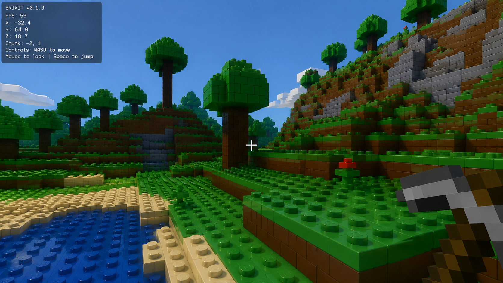

<div align="center">

# BRIXIT


</div>

---

## What is this

BRIXIT is a first-person survival game set in an infinite procedurally-generated world where everything is LEGO.  



---

## Features

| Feature | Description |
|---|---|
| Infinite Procedural Terrain | Endless world, generated in chunks. |
| LEGO-Style Plastic Materials | Every block has actual stud geometry. |
| Block Placing & Breaking | You can break things & place things. |
| First-Person Controls | WASD to move, mouse to look, Space to jump. |
| Brick Particle Effects | Blocks shatter into stud particles, inspired by classic LEGO games |

---

## Controls

```txt
WASD          — Move 
Mouse         — Look around 
Left Click    — Break block
Right Click   — Place block
Space         — Jump 
